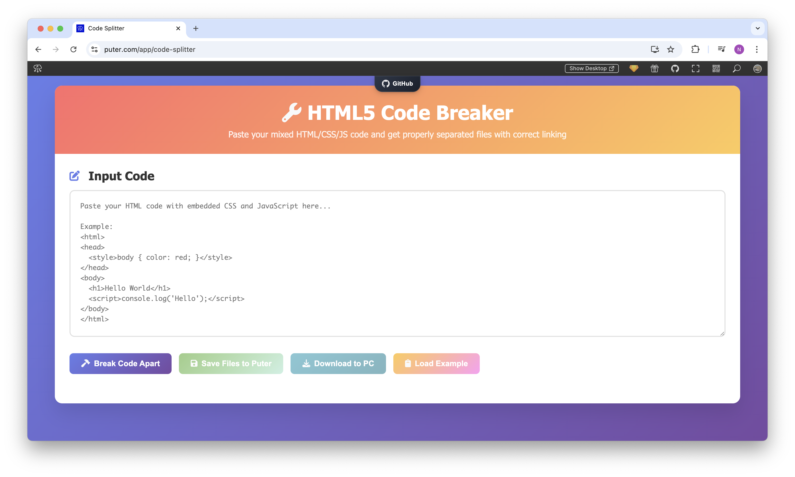

<h1 align="center">
  <a href="https://puter.com/app/code-splitter" target="_blank">HTML5 Code Breaker</a>
</h1>

<p align="center">A web-based tool that splits mixed HTML, CSS, and JavaScript code into separate, properly linked files.
</p>

<p align="center">
  
</p>

<br>

## Features

- **Automatic Code Separation**: Extracts CSS and JavaScript from HTML files
- **Proper File Linking**: Generates HTML with correct stylesheet and script references
- **Code Visualization**: View the separated code with syntax highlighting
- **File Management**: Save files directly to Puter cloud storage
- **Local Download**: Download all files as a ZIP archive to your PC
- **Example Code**: Built-in example to demonstrate functionality
- **Modern UI**: Clean, responsive interface that works on all devices

<br>

## Getting Started

Clone the repository: 

```bash
git clone https://github.com/puter-apps/code-splitter.git
```

Access the `index.html` file via a local server or an [online host](https://puter.com)

<br>

## How It Works

HTML5 Code Breaker leverages [**Puter.js**](https://developer.puter.com/) to provide a seamless web-based code separation experience:

1. **Code Parsing**: Uses DOM parser to intelligently extract embedded CSS and JavaScript
2. **File System Integration**: Employs Puter's file system API to save generated files
3. **Authentication**: Utilizes Puter's authentication system for secure cloud storage
4. **ZIP Generation**: Creates downloadable archives for local use

<br>

## License

MIT
